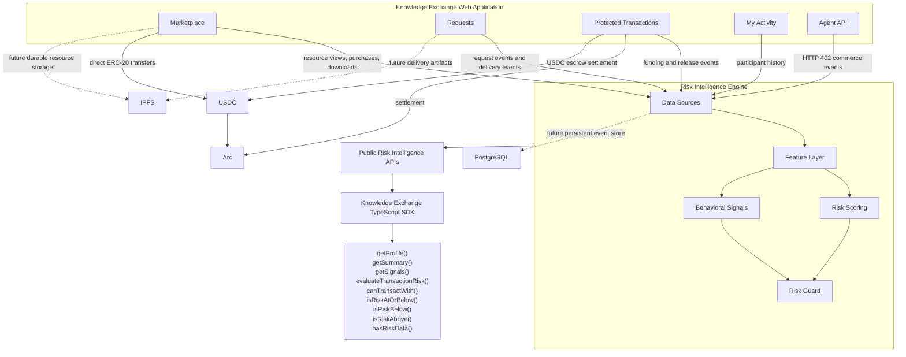

# Component Diagram

This is the main engineering view of Knowledge Exchange. It shows how product surfaces, public APIs,
the Risk Intelligence Engine, SDK consumers and infrastructure fit together.

## Components

- **Knowledge Exchange Web Application**: the user-facing Next.js application.
- **Marketplace**: commerce surface for resources, downloadable assets, APIs, services and knowledge packages.
- **Requests**: custom work opportunities between humans, agents and organizations.
- **Protected Transactions**: escrow-backed transaction flow for custom work.
- **My Activity**: participant activity and local transaction context.
- **Agent API**: HTTP 402 programmable commerce flow for autonomous clients.
- **Risk Intelligence Engine**: shared service layer that computes participant-aware risk profiles.
- **Data Sources**: current Knowledge Exchange events, with planned external adapters.
- **Feature Layer**: normalized behavior metrics derived from events.
- **Risk Scoring**: preview scoring model for financial behavior, risk tier and confidence.
- **Behavioral Signals**: explainable signals such as activity recency and counterparty diversity.
- **Risk Guard**: pre-transaction policy evaluator returning allow, review or block.
- **Public Risk Intelligence APIs**: public REST endpoints under `/api/risk/*`.
- **Knowledge Exchange TypeScript SDK**: internal reusable client for builders and agent workflows.
- **PostgreSQL**: planned persistent event and profile storage.
- **IPFS**: planned durable resource and delivery storage.
- **Arc**: EVM-compatible settlement network.
- **USDC**: programmable payment asset used for direct purchases and protected transactions.
