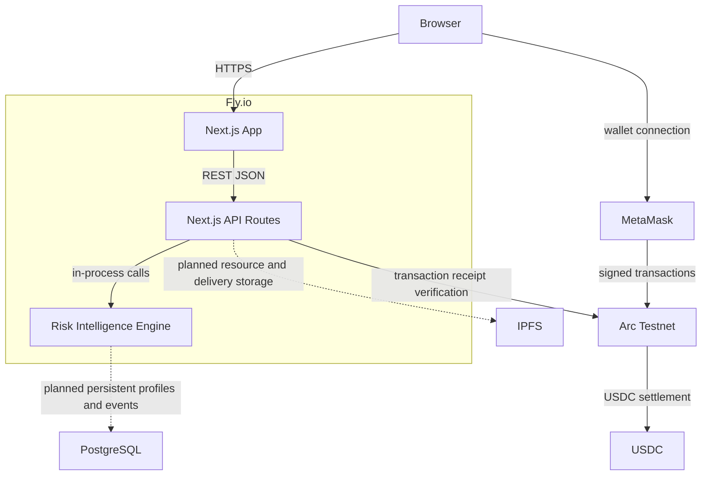

# Deployment Diagram

This diagram shows the runtime architecture for the current MVP and planned persistence layers.
The deployed app runs on Fly.io, serves the Next.js application over HTTPS, and interacts with Arc
Testnet through wallet and API flows.

## Components

- **Browser**: user or agent operator interface.
- **MetaMask**: wallet used for Arc Testnet interaction and USDC transactions.
- **Fly.io**: hosting platform for the Next.js runtime.
- **Next.js App**: App Router frontend rendered by the deployed application.
- **Next.js API Routes**: REST JSON endpoints for resources, requests, Agent API and Risk Intelligence.
- **Risk Intelligence Engine**: server-side risk profile and Risk Guard logic.
- **PostgreSQL**: planned durable database for events, profiles and marketplace records.
- **IPFS**: planned durable storage for resource payloads and delivery artifacts.
- **Arc Testnet**: EVM-compatible network for transaction proofs and settlement.
- **USDC**: payment asset used across marketplace and protected transaction workflows.
