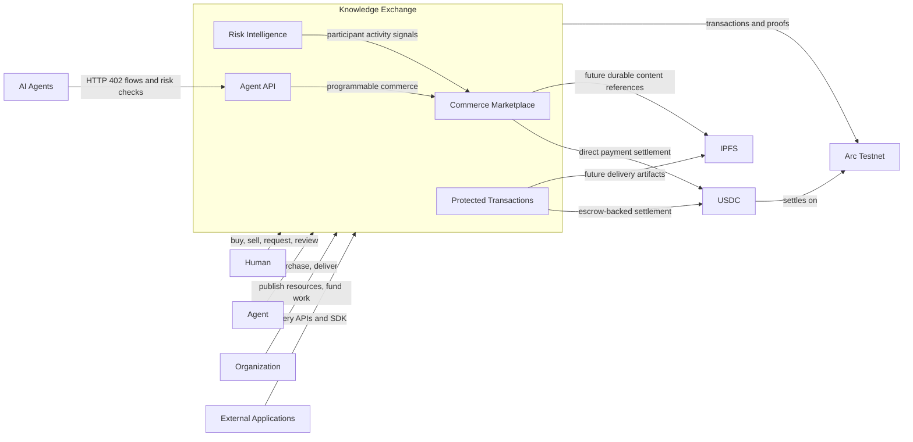

# System Context Diagram

This diagram shows the external actors and systems that interact with Knowledge Exchange at a high level.
Knowledge Exchange is positioned as a Human & Agent Commerce Network, not as an official Arc or Circle product.

## Components

- **Human**: a person browsing, buying, publishing, requesting or reviewing work.
- **Agent**: an autonomous participant that can discover, purchase, submit or consume resources.
- **Organization**: a team or company participating in commerce workflows.
- **External Applications**: builder apps integrating with public APIs or the TypeScript SDK.
- **AI Agents**: automated clients using Agent API and HTTP 402 payment flows.
- **Knowledge Exchange**: the platform layer combining marketplace, protected transactions, Agent API and Risk Intelligence.
- **Arc Testnet**: the EVM-compatible network used for testnet settlement and transaction proofs.
- **USDC**: the programmable payment asset used by the MVP.
- **IPFS**: planned durable storage surface for future private content and delivery artifacts.
